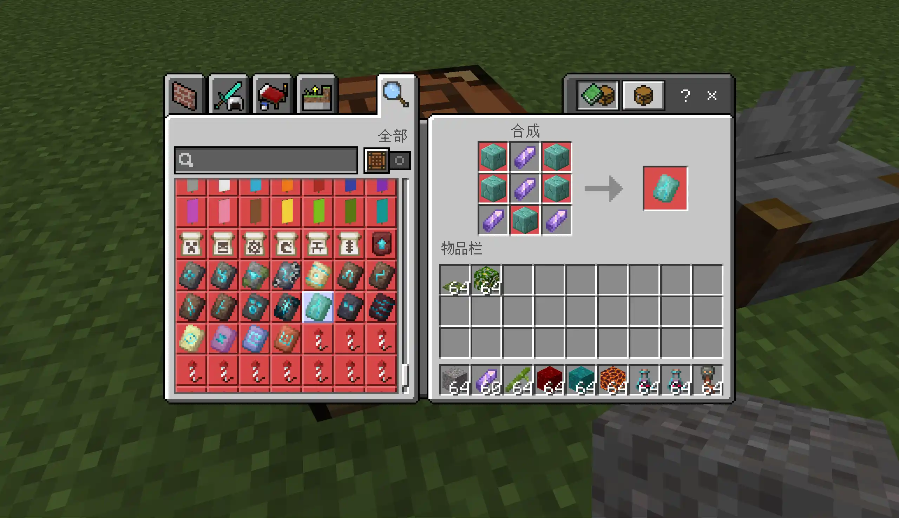

# Clever Craft

[English](README.md) | 简体中文

**Clever Craft** 是一个 Minecraft 基岩版（Bedrock Edition）Addon，为游戏加入了一些**合理的合成配方**。

在原版 Minecraft 中，有许多物品看起来应该可以合成，但实际上却没有对应配方。  
这个 addon 为这些情况补充了一些符合直觉的配方，同时尽量保持原版的游戏体验。

## 示例

本 addon 加入的一些配方示例：

- 地狱疣块 → 地狱疣
- 岩浆块 → 岩浆膏
- 丛林树叶 → 可可豆
- 竹子 → 纸
- 沙砾 → 燧石（切石机）

此外，一些盔甲纹饰模板也可以通过方块和紫水晶合成。

## 设计理念

Clever Craft 的目标**不是降低获取难度**，而是补充一些符合直觉、看起来就应该存在的配方。

有些内容没有加入，因为它们本身已经很容易获得。

## 建议

如果你有想加入的配方建议，欢迎在 GitHub Issues 中提出！

## 安装方法 
1. 前往 Releases 页面下载最新版本。
2. 导入行为包到 Minecraft 基岩版。
3. 在世界设置中启用该行为包。

## 开源许可 
MIT License 

## 贡献代码 
欢迎提交 Pull Request！
